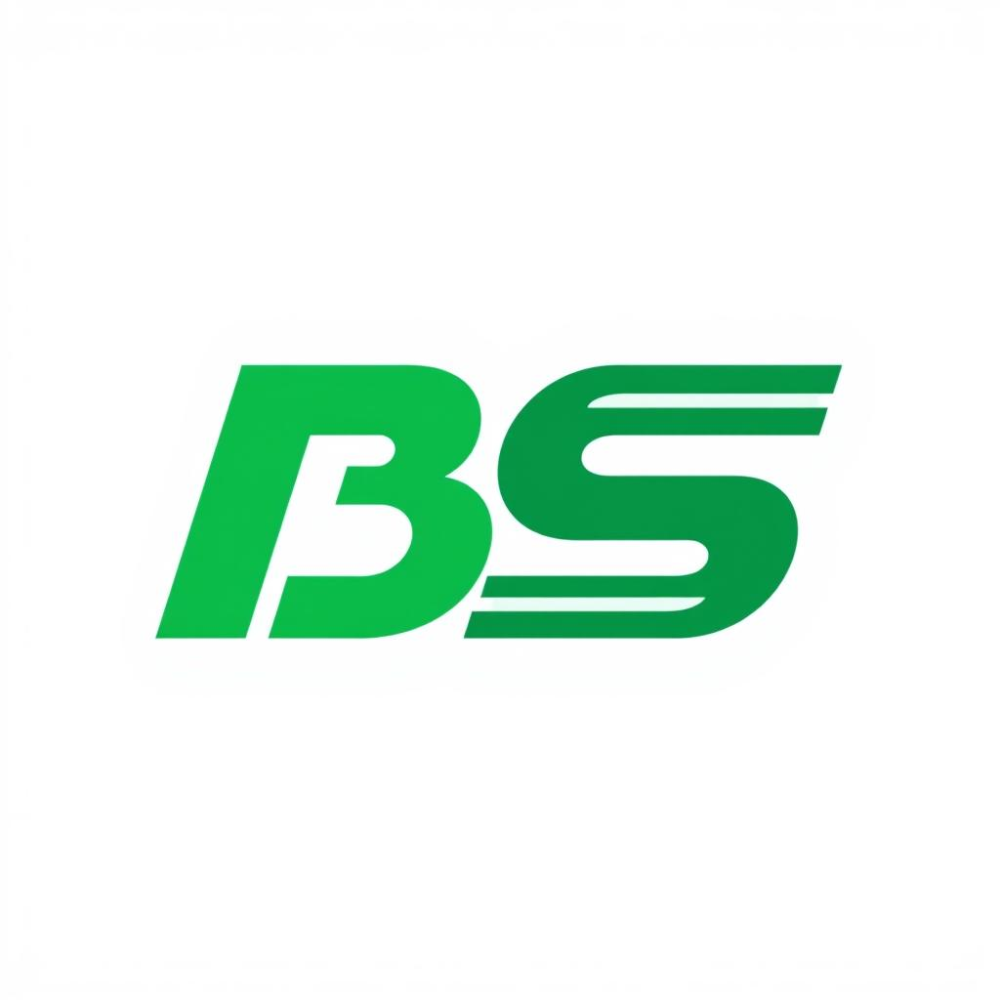

# 🚀 BrandStudio — The Ultimate AI Branding Platform



**BrandStudio** is an elite, all-in-one AI branding suite designed to transform a simple idea into a fully realized, premium brand identity in seconds. Built for high-performance entrepreneurs and designers, it leverages the fastest AI inference on the planet (Groq LPUs) and state-of-the-art image generation (FLUX.1).

---

## 🛠 Tech Stack

### Frontend & Core
- **Framework**: [React 18](https://reactjs.org/) (Functional Components, Hooks)
- **Build Tool**: [Vite](https://vitejs.dev/) (Lightning fast HMR)
- **Language**: [TypeScript](https://www.typescriptlang.org/) (Strictly typed)
- **Styling**: [Tailwind CSS v4](https://tailwindcss.com/)
- **Animation**: [Motion](https://www.framer.com/motion/) (Fluid 60fps transitions)
- **Icons**: [Lucide React](https://lucide.dev/)

### AI & Backend Services
- **Text Intelligence**: [Groq](https://groq.com/) (**Llama 3.3 70B**) — Sub-second response times for strategy and copy.
- **Visual Engine**: [HuggingFace](https://huggingface.co/) (**FLUX.1-schnell**) — High-resolution, professional vector-style logos.
- **Authentication**: [Firebase Auth](https://firebase.google.com/docs/auth) — OAuth and Secure JWT.
- **Analytics**: [Firebase Analytics](https://firebase.google.com/docs/analytics) — Real-time user event tracking.

---

## ✨ Core Platforms

### 1. 💡 Intelligence-Driven Naming
Generate 10 unique, catchy, and memorable startup names. Each name includes a **Strategic Rationale** effectively explaining the linguistic and psychological benefits for your specific audience.

### 2. 🎨 Premium Logo Designer (v2.0)
Our logo engine is specifically tuned for **Production-Ready** branding:
- **Styles**: Minimalist, **Corporate (High-Trust)**, **Monogram (Initials-focused)**, Futuristic, and 6+ more.
- **Letterform Integration**: The AI specifically attempts to weave your brand's first initials (e.g., "S" for SmartBridge) into the icon.
- **Negative Space**: Optimized to produce clean icons that work on light and dark backgrounds.

### 3. ✍️ Content & Copy Lab
Eliminate writer's block with specialized generators for:
- **Taglines**: Provocative, non-cliché slogans.
- **Mission Statements**: 150-word "About Us" sections reflecting core values.
- **Social Media Pack**: Tailored captions for LinkedIn (professional), Instagram (visual), and X (punchy).

### 4. 🍭 Harmonic Color Theorist
Generates complete 6-color palettes (Primary, Secondary, Accent, Background, Surface, Text). Each color includes a usage guide based on modern UI/UX principles.

### 5. 🔍 Sentiment & Perception AI
Input your brand copy to receive a "Perception Score." The AI identifies emotional triggers and provides 3 actionable ways to shift your tone toward your goal (e.g., from "Aggressive" to "Authoritative").

---

## 💡 Advanced Usage Tips

### Logo Prompt Engineering
While the system handles the complexity, adding these "Features" yields elite results:
- **Monograms**: "Interlocking letters with geometric precision."
- **Corporate**: "Balanced visual hierarchy with a sense of stability."
- **Minimalist**: "Single line weight, high negative space usage."

### Context-Aware Detection
The system automatically boosts intelligence for specific keywords:
- **"Smart" / "Intel"**: Triggers neural and lightbulb visual cues.
- **"Tech" / "Systems"**: Triggers circuit and node-link patterns.
- **"Edu" / "Intern"**: Triggers growth and academy motifs.

---

## 🚀 Installation & Setup

### 1. Requirements
- Node.js (v18+)
- A Groq API Key (Free tier available)
- A HuggingFace API Key

### 2. Setup
```bash
# Clone and install
git clone https://github.com/your-username/brandstudio.git
cd brandstudio
npm install

# Configure environment
cp .env.example .env
```

### 3. Environment Config
Ensure your `.env` contains:
```env
VITE_GROQ_API_KEY=gsk_your_key
VITE_HF_API_KEY=hf_your_key
# ... add Firebase keys from console
```

### 4. Run
```bash
npm run dev
```

---

## 🎨 Design Philosophy
BrandStudio follows a **Glassmorphic Dark Mode** aesthetic:
- **Transparency**: 80% opacity layers with `backdrop-blur`.
- **Gradients**: Linear 45-degree sweeps (Emerald to Indigo).
- **Typography**: Uses `Inter` for readability and `Outfit` for headings.

---

## 📂 Architecture
```
src/
├── services/        # AI logic & API Wrappers (Groq/HF)
├── contexts/        # Global state (Theme, Auth, Brand Context)
├── components/      # Functional UI modules
├── lib/             # Third-party initializations (Firebase/Utils)
└── pages/           # High-level route views
```

---

**Built with ❤️ for the next generation of founders.**
